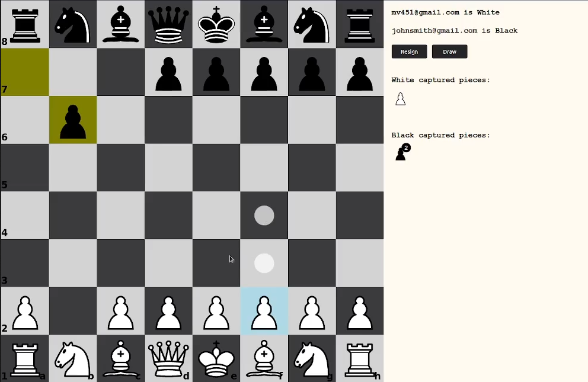

# Table of Contents

1.  [Chess Project](#org35fb693)
    1.  [About](#org912a82f)
    2.  [Getting Started](#orgd728280)

# Chess Project

## About

This is a two-player chess game meant to be played on the same computer. Most rules are implemented with the exception of some dead positions. Login & Signup just stores the user info in local storage (since this was a university project and not a real game.)

## Getting Started

Serve the root folder and go to /html/index.php to go the login page.
